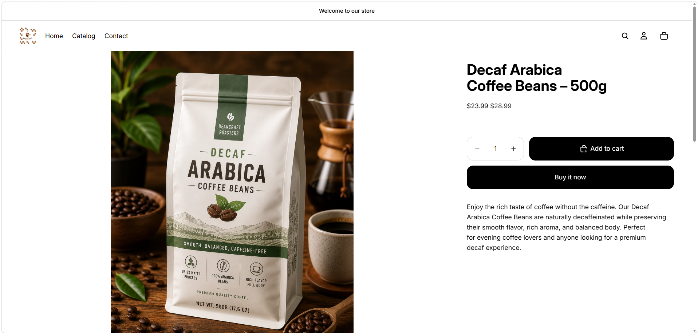
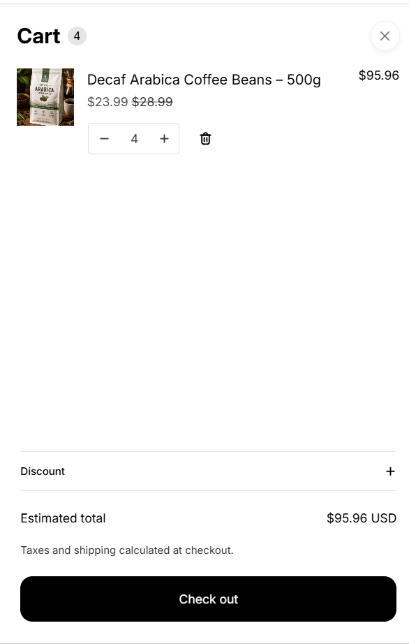
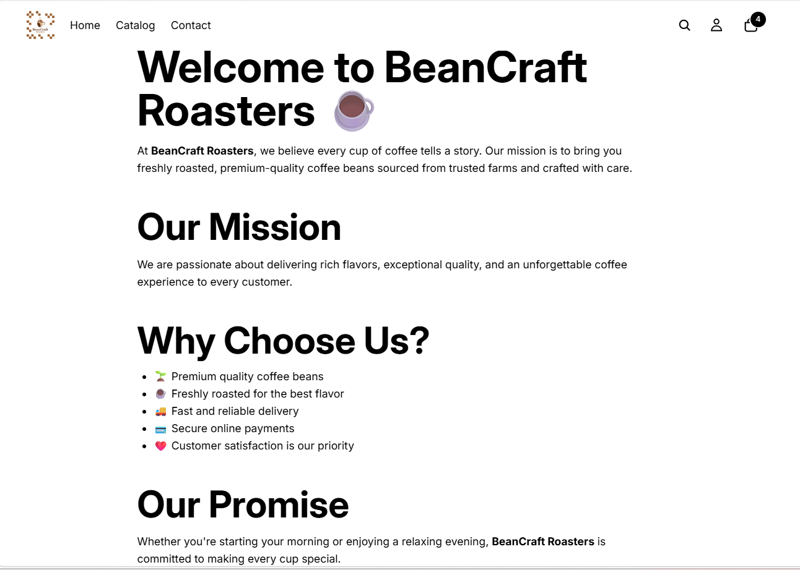
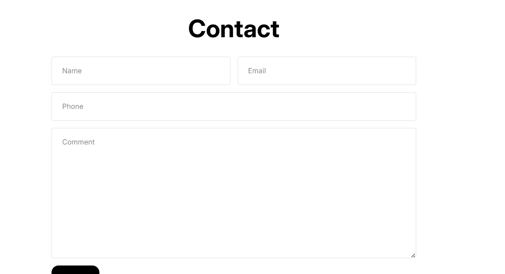
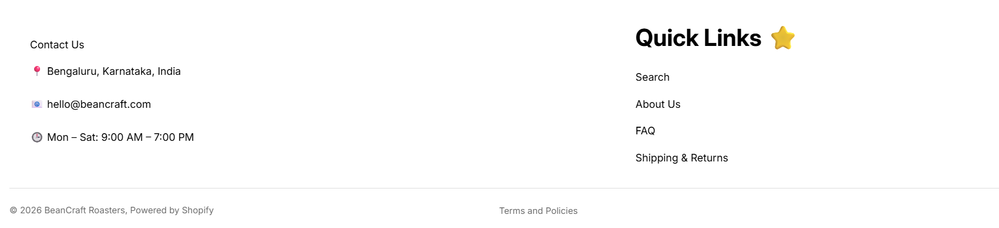

# ☕ BeanCraft Roasters Shopify Store

A fully customized Shopify e-commerce theme developed for the **BeanCraft Roasters** online coffee store. This project demonstrates Shopify theme customization using Liquid, HTML, CSS, JavaScript, and JSON to create a responsive and user-friendly shopping experience.

---

## 🚀 Features

- Responsive Shopify theme
- Custom homepage sections
- Product listing and product detail pages
- Collection pages
- Shopping cart functionality
- Theme customization support
- Multi-language support
- Mobile-friendly design
- Reusable Shopify Liquid components

---

## 🛠️ Tech Stack

- Shopify Liquid
- HTML5
- CSS3
- JavaScript (ES6)
- JSON
- Git
- GitHub

---

## 📁 Project Structure

```
assets/
blocks/
config/
layout/
locales/
sections/
snippets/
templates/
README.md
```

---

## 📂 Folder Description

| Folder | Purpose |
|---------|----------|
| assets | CSS, JavaScript, fonts, and images |
| blocks | Reusable theme blocks |
| config | Theme settings and configuration |
| layout | Main Shopify layout files |
| locales | Language translation files |
| sections | Dynamic Shopify sections |
| snippets | Reusable Liquid snippets |
| templates | Page templates for different store pages |

---

## 💡 Key Highlights

- Customized Shopify theme using Liquid templates
- Organized reusable sections and snippets
- Responsive layout for desktop and mobile devices
- Version controlled using Git and GitHub
- Clean and maintainable project structure

---

## 📸 Screenshots

You can add screenshots of:

- Home Page
- Product Page
- Collection Page
- Cart Page

---

## 📖 What I Learned

- Shopify Theme Development
- Shopify Liquid Templating
- Theme Customization
- Responsive Web Design
- Git & GitHub Workflow
- Store Structure Management
...

## 📸 Screenshots

### 🏠 Home Page


### 🛍️ Product details


### ☕ Product (2)
.png)
### 🛒 Shopping Cart


### 🏢 About Us


### 📞 Contact Us


### ❓ FAQ


### 🚚 Shipping & Returns


### 📌 Footer


## 👩‍💻 Author

**Sneha Hiremath**

GitHub: https://github.com/SnehaHiremath-859

Repository: https://github.com/SnehaHiremath-859/beancraft-roasters-shopify-store

---

## 📄 License

This project is intended for educational and portfolio purposes.
